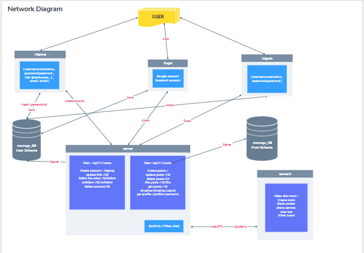
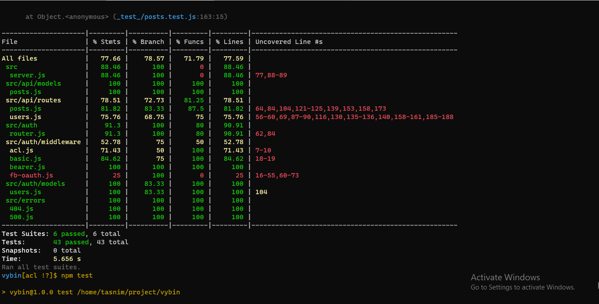
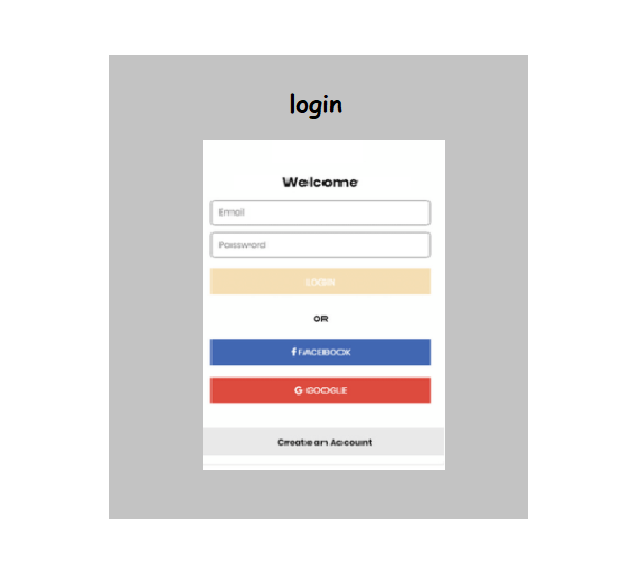
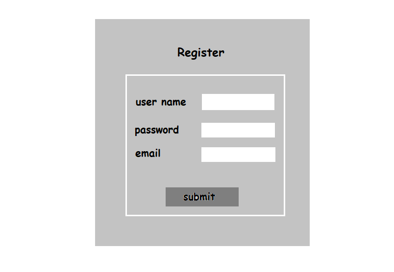
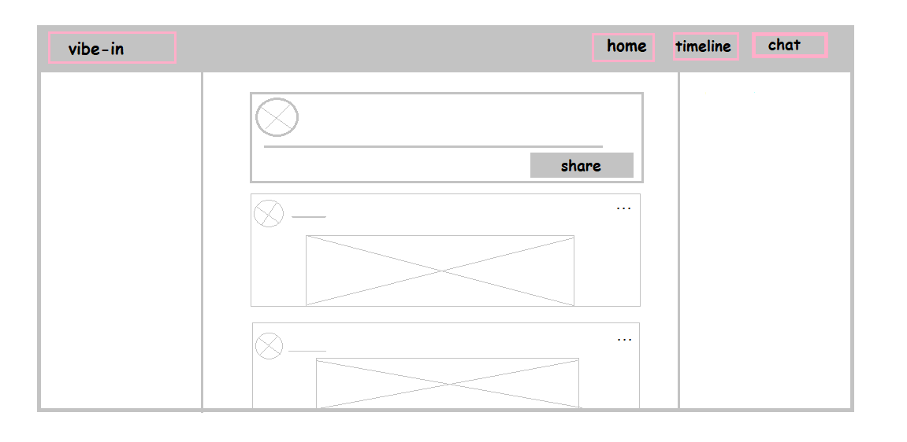
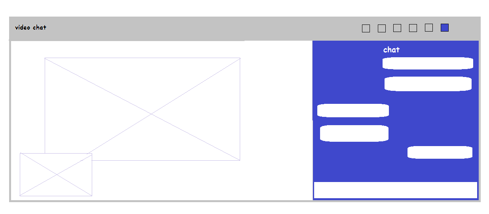
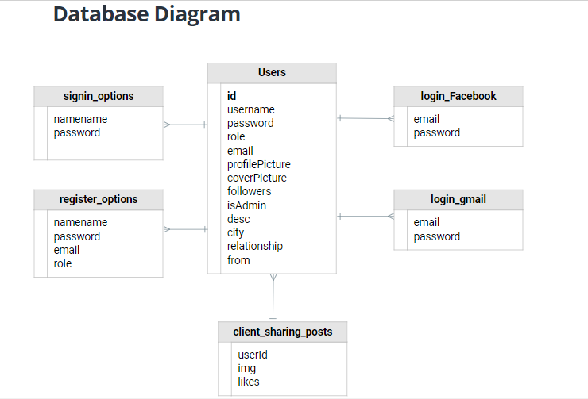

# vibe-in Social Media

## Team Members
1. Omar Ewies (TL)
2. Tasnim Al-wahebi
3. Ahmad Arman
4. Anwar Shraideh

## Description

Vibe-in is a Social media  CRUD web application built with MERN stack. It breaks the distance between users by allowing them to share their life events and to chat with each other.

## User Story

Kindly check our users stories from [HERE](https://trello.com/b/ZUhWSKWo/vibe-in-userstory)

## Domain Modeling

### **UML**

### **Test**

### **Wireframe**

### **Database Diagram**
